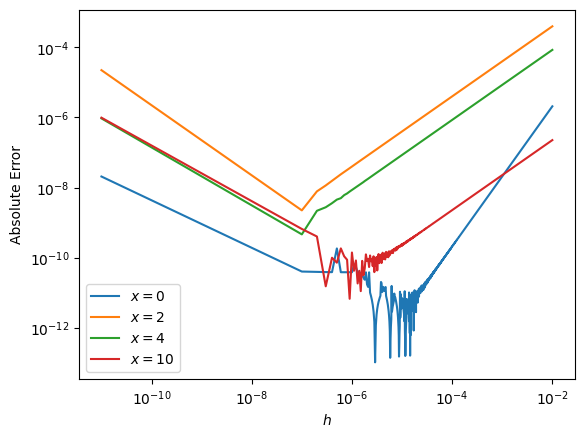
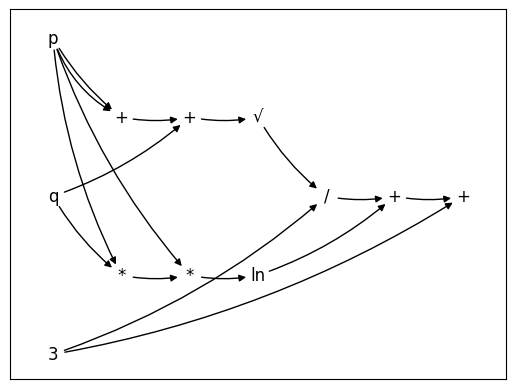

# AutoDiff

The goal of this project is to be a stepping stone toward building a transformer from scratch (i.e., without TensorFlow or PyTorch). In order to circumvent both APIs, we have to understand what they are used for. Both libraries help streamline the construction of neural networks by making layers, regularizers, activations, etc. all seamlessly integrate together with fully-optimized library code. One of the particular advantages of using these libraries is not having to compute the gradient of loss function by hand. Before these libraries became popular (and although it was common in other fields outside of machine learning), it was common for researchers to painstakingly derive analytic solutions or approximations to their loss functions by hand before coding their models. Automatic differentiation (AD) alleviates the need to compute these tiresome derivatives using some clever techniques that we explore below, but before we can understand _what AD is_, we must understand what it _isn't_ and what alternatives it supplants.

## Numerical Differentiation


Recall the limit definition of the derivative: $f'(x) = \lim_{h \to 0}\frac{f(x+h) - f(x)}{h}$. It follows that we can approximate the derivative if we fix a small $h$. While this definition is perfect in theory, in practice dividing by a small $h$ on a computer leads to numerical errors and dividing by a large $h$ gives a bad approximation.

Below, we can see how the error changes with $h$. In this example, I used the sigmoid function and it's derivative.

<p align="center">
  
</p>


### Numerical Errors: [Rounding](https://en.wikipedia.org/wiki/Round-off_error) and [Truncation](https://en.wikipedia.org/wiki/Truncation_error)

**Rounding Errors**: computers are limited in how they represent numbers
* _magnitude_: there are upper and lower bounds on what numbers computers can represent
* _precision_: not all numbers can be represented exactly

**Truncation Errors**: errors that result from the use of an approximation rather than an exact expression


(Source: [MAE 4020/5020](https://web.engr.oregonstate.edu/~webbky/MAE4020_5020_files/Section%204%20Roundoff%20and%20Truncation%20Error.pdf))

## Automatic Differentiation

### Forward Mode

#### Operator Overloading

#### Aside: Computational Graphs

I implemented a custom computational graph engine as a sidequest. Here we see the computational graph (CG) for the equation $\sqrt{p + p + q} / 3 + \ln(p(pq)) + 3$. The graph is produced by overwriting python operators for a custom class that maintains a topologically-ordered directed multigraph.

```python
import compgraph as cg

p = cg.Variable("p")
q = cg.Variable("q")
k = cg.Variable(3)
expression = cg.sqrt(p + p + q) / k + cg.ln(p * (p * q)) + k
expression.graph()
```
<p align="center">
  
</p>


#### Compiler Stuff

## Reverse mode

### Back Prop
